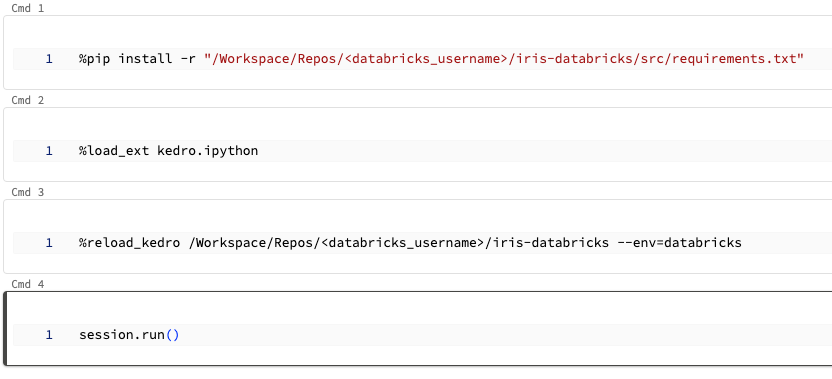
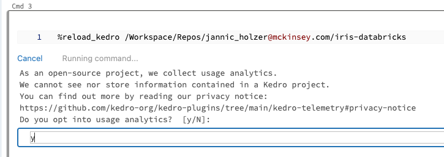

# Databricks development workflow

This guide demonstrates a development workflow for Kedro projects on Databricks using Databricks Repos, using the PySpark Iris starter. This workflow enables you to use your local environment for development and Databricks notebooks for testing. It has several advantages for development relative to using only Databricks notebooks as it enables the use of powerful development features offered by an IDE that are not available on Databricks notebooks:

- Auto-completion and suggestions for code, improving your development speed and accuracy.
- Linters like Pylint or Flake8 can be integrated to catch potential issues in your code.
- Static type checkers like Mypy can check types in your code, helping to identify potential type-related issues early in the development process.

To set up these features, look for instructions specific to your IDE (for instance, [VS Code](https://code.visualstudio.com/docs/python/linting)).

## Prerequisites

- Active [Databricks deployment](https://docs.databricks.com/getting-started/index.html).
- A [Databricks cluster](https://docs.databricks.com/clusters/configure.html) configured with a recent version (>= 11.3 is recommended) of the Databricks runtime.
- [Conda installed](https://docs.conda.io/projects/conda/en/latest/user-guide/install/index.html) on your local machine.

## Set up your project

### Create a virtual environment and install Kedro and dbx

In your local development environment, create a virtual environment for this tutorial using Conda:

```bash
conda create --name iris-databricks python=3.10
```

Once it is created, activate it:

```bash
conda activate iris-databricks
```

With your Conda environment activated, install Kedro and dbx:

```bash
pip install kedro dbx --upgrade
```

dbx is an extension of the Databricks CLI, a command-line program for interacting with Databricks without using its UI. You will use dbx to sync code your project with Databricks.

After installing dbx, you must authenticate the Databricks CLI with your [Databricks instance](https://docs.databricks.com/dev-tools/cli/index.html#set-up-authentication).

### Create a new Kedro project

Create a Kedro project with the PySpark Iris starter. To do this, run the following command in your local environment:

```bash
kedro new --starter=pyspark-iris
```

Name your new project `iris-databricks` for consistency with the rest of this guide. This command creates a new Kedro project using the PySpark Iris starter template.

### Create a repo on Databricks and sync your project

Create a new repo on Databricks by navigating to `New` tab in the Databricks workspace UI side bar and clicking `Repo` in the drop-down menu that appears.

In this guide, you will not sync your project with a remote Git provider, so uncheck `Create repo by cloning a Git repository` and enter `iris-databricks` as the name of your new repository:


The next step is to use dbx to sync your project to your repo. Open a new terminal instance, activate your conda environment, navigate to your project directory and start `dbx sync`:

```bash
conda activate iris-databricks
cd <project_root>
dbx sync repo -d iris-databricks -s . -fi conf/local
```

Successfully starting `dbx sync` will write output similar to the following:

```{bash}
...
[dbx][2023-04-13 21:59:48.148] Putting /Repos/<databricks_username>/iris-databricks/src/tests/__init__.py
[dbx][2023-04-13 21:59:48.168] Putting /Repos/<databricks_username>/iris-databricks/src/tests/test_pipeline.py
[dbx][2023-04-13 21:59:48.189] Putting /Repos/<databricks_username>/iris-databricks/src/tests/test_run.py
[dbx][2023-04-13 21:59:48.928] Done. Watching for changes...
```

`dbx sync` will automatically sync any further changes made in your local project directory with your Databricks repo while it runs.

```{note}
Syncing with dbx is one-way only, meaning changes you make using the Databricks Repos code editor will not be reflected in your local environment. Only make changes to your project in your local environment while syncing, not in the editor that Databricks Repos provides.
```

### Upload project data to DBFS

In this demonstration project, you will upload the project data to DBFS as the PySpark Iris starter comes with a catalog set up to access data stored on DBFS.

There are several ways to upload data to DBFS. In this guide, it is recommended to use [Databricks CLI](https://docs.databricks.com/dev-tools/cli/dbfs-cli.html) because of the convenience it offers. Use the following Databricks CLI command to upload your data:

```bash
databricks fs cp -r data/ dbfs:/root/projects/iris-databricks/data
```

The --recursive flag ensures that the entire folder and its contents are uploaded. You can list the contents of the destination folder in DBFS using the following command:

```bash
databricks fs ls dbfs:/root/projects/iris-databricks/data
```

You should see the contents of the project's `data/` directory printed to your terminal:

```bash
01_raw
02_intermediate
03_primary
04_feature
05_model_input
06_models
07_model_output
08_reporting
```

### Create a new Databricks notebook

Now that your project is available on Databricks, you can run it on a cluster using a notebook.

To run the Python code from your Databricks repo, [create a new Python notebook](https://docs.databricks.com/notebooks/notebooks-manage.html#create-a-notebook) in your workspace. Name it `iris-databricks` for traceability and attach it to your cluster:

[Create a new notebook on Databricks](../meta/images/databricks_notebook_creation.png)

### Run your project

To run your project in your notebook, create four new cells with the following commands. Remember to replace `<databricks_username>` with your username on Databricks such that `project_root` correctly points to your project's location.

1. Before you import and run your Python code, you'll need to install your project's dependencies on the cluster attached to your notebook. Your project has a `requirements.txt` file for this purpose. Add the following code to the first new cell to install the dependencies:

```ipython
%pip install -r "/Workspace/Repos/<databricks_username>/iris-databricks/src/requirements.txt"
```

2. To run your project in your notebook, you must load the Kedro IPython extension. Add the following code to the second new cell to load the IPython extension:

```ipython
%load_ext kedro.ipython
```

3. Loading the extension allows you to use the `%reload_kedro` line magic to load your Kedro project. The `--env=databricks` option will make Kedro use the `databricks` environment. The `databricks` environment is defined in the PySpark Iris starter and directs Kedro to use the configuration in the `conf/databricks` directory. To learn more about environments in Kedro configuration, see the [documentation](../configuration/configuration_basics.md#configuration-environments). Add the following code to the third new cell to load your Kedro project:

```ipython
%reload_kedro /Workspace/Repos/<databricks_username>/iris-databricks --env=databricks
```

4. Loading your Kedro project with the `%reload_kedro` line magic will define four global variables in your notebook: `context`, `session`, `catalog` and `pipelines`. You will use the `session` variable to run your project. Add the following code to the third new cell to run your Kedro project:

```ipython
session.run()
```

At the end of these steps, your notebook should match the image:



Run the completed notebook using the `Run All` bottom in the top right of the UI:


On your first run, you will be prompted to consent to analytics, type `y` or `N` in the field that appears and press `Enter`:



You should see logging output while the cell is running. After execution finishes, you should see output similar to the following:

```bash
...
[08/09/22 11:23:30] INFO     Model has accuracy of 0.960 on test data.                                        nodes.py:74
                    INFO     Saving data to 'metrics' (MetricsDataSet)...                             data_catalog.py:382
                    INFO     Completed 3 out of 3 tasks                                           sequential_runner.py:85
                    INFO     Pipeline execution completed successfully.                                      runner.py:89
```

## Modify and test your project

Now that your project has run successfully once, you can make changes using the convenience and power of your local development environment. In this section, you will change your project to use a modified classifier to create predictions on the iris data.

### Modify the training / test split ratio

The PySpark Iris starter uses a default 80-20 ratio of training data to test data when training the classifier. In this section, you will change this ratio to 70-30 by locally editing your project, then run the modified project on Databricks to observe the difference.

Open the file `<project_root>/conf/parameters.yml` in your local environment. Edit the line `train_fraction: 0.8` to `train_fraction: 0.7` and save your changes. Look in the terminal where `dbx sync` is running, you should see it automatically sync your changes with your Databricks repo:

```bash
...
[dbx][2023-04-14 18:29:39.235] Putting /Repos/<databricks_username>/iris-databricks/conf/base/parameters.yml
[dbx][2023-04-14 18:29:40.820] Done
```

### Re-run your project

Return to your Databricks notebook. Re-run the cell containing the code `session.run()`. The project will now run again, giving output similar to the following:

```bash
...
[08/09/22 11:23:30] INFO     Model has accuracy of 1.000 on test data.                                        nodes.py:74
                    INFO     Saving data to 'metrics' (MetricsDataSet)...                             data_catalog.py:382
                    INFO     Completed 3 out of 3 tasks                                           sequential_runner.py:85
                    INFO     Pipeline execution completed successfully.                                      runner.py:89
```

You can see that your model's accuracy has changed now that you are using a different classifier to produce the result. As it seems that the accuracy of your classifier on test data has improved, you decide to merge these changes to the `main` branch of your project.

```{note}
If your cluster terminates, you must re-run the cell containing the `%pip ...` magic to re-install your project's dependencies. If not, repeating this step is only necessary if your project's requirements change.
```

## Summary

This tutorial covered a hybrid Kedro project development workflow on Databricks, using your local development environment, dbx and Databricks repos to sync code, improving development efficiency.
